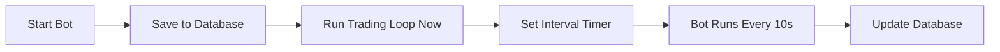

# Trading Bot Persistence Fix

## Issues Fixed

### 1. **Bot Stops When Page Refreshes**
- **Problem**: Bot state was stored in memory and lost on server restart
- **Solution**: Bot state now persisted in Supabase database
- Tables created: `bot_state` and `bot_logs`

### 2. **No Signals Generated / No Trades Executed**
- **Problem**: Bot waited for interval timer before running
- **Solution**: Bot now runs immediately when started, then continues on interval
- Better error logging to identify issues

### 3. **Bot State Not Visible Across Sessions**
- **Problem**: Bot status wasn't saved
- **Solution**: All bot configuration and status saved to database

## What Changed

### Database Tables Created

#### `bot_state` table:
- Stores whether bot is running
- Stores bot configuration
- Tracks last run time
- Stores any errors

#### `bot_logs` table:
- Logs all bot actions (start, stop, execute, errors)
- Stores signals generated
- Helps with debugging

### Code Changes

#### `app/api/trading/route.ts`:
1. Bot state now persisted to database using `update_bot_state()` function
2. Bot runs immediately when started (doesn't wait for interval)
3. Bot state retrieved from database on status check
4. Better error handling and logging

## Installation Steps

### 1. Apply the Database Migration

**Option A: Supabase SQL Editor**
1. Go to your Supabase dashboard
2. Navigate to SQL Editor
3. Copy contents of `apply-bot-persistence-migration.sql`
4. Run the SQL

**Option B: Supabase CLI**
```bash
supabase db push
```

### 2. Verify ML Service Configuration

Check that your ML service URL is configured. Add to `.env.local`:

```env
ML_SERVICE_URL=your_ml_service_url_here
```

If you don't have an ML service deployed yet, the bot will use test signals.

### 3. Restart Your Application

```bash
npm run dev
```

### 4. Test the Bot

1. Go to Paper Trading or Live Trading page
2. Click "Start Bot"
3. **Bot will run immediately** (you should see signals within 30 seconds)
4. Refresh the page - **bot should still show as running**
5. Check Trade Logs to see generated signals

## How It Works Now

### Starting the Bot

1. User clicks "Start Bot"
2. Bot configuration saved to database
3. **Trading loop runs immediately**
4. Signals generated and shown in UI
5. Bot continues to run on interval (default: 10 seconds)

### Bot State Persistence



### After Page Refresh

1. Frontend requests bot status
2. Backend checks database for bot state
3. If bot was running:
   - Shows as "Running" in UI
   - Interval continues in background
   - Signals from last run displayed

## Troubleshooting

### Bot Shows Running But No Signals

**Check the browser console and server logs for errors:**

1. **ML Service Error**:
   ```
   ML service unavailable after 2 attempts
   ```
   - **Fix**: Configure `ML_SERVICE_URL` in `.env.local`
   - Or deploy ML service to Google Cloud Run

2. **Alpaca API Error**:
   ```
   API keys not found
   ```
   - **Fix**: Configure Alpaca API keys in Settings page

3. **Technical Indicators Error**:
   ```
   Failed to get technical indicators
   ```
   - **Fix**: Check Alpaca API rate limits
   - Reduce number of symbols being tracked

### Bot Stops After Refresh

1. Check that migration was applied:
   ```sql
   SELECT * FROM bot_state;
   ```

2. Check for errors in `bot_logs`:
   ```sql
   SELECT * FROM bot_logs ORDER BY created_at DESC LIMIT 10;
   ```

3. Check server logs for interval errors

### No Trades Being Executed

1. **Check market hours**: Market must be open for live trading
2. **Check confidence levels**: Signals must meet minimum confidence (55%+)
3. **Check account balance**: Must have sufficient buying power
4. **Check positions**: Bot won't buy if already holding the symbol

## Key Improvements

### Before Fix:
- ❌ Bot stopped on page refresh
- ❌ Had to wait for interval timer to see first signals
- ❌ No persistence of bot state
- ❌ Poor error visibility

### After Fix:
- ✅ Bot persists across page refreshes
- ✅ Signals generated immediately on start
- ✅ Bot state saved in database
- ✅ Clear error messages in UI and logs
- ✅ Better debugging with `bot_logs` table

## Monitoring Your Bot

### Check Bot Status
```sql
SELECT * FROM bot_state WHERE user_id = 'your-user-id';
```

### View Recent Bot Actions
```sql
SELECT 
  action, 
  message, 
  created_at 
FROM bot_logs 
WHERE user_id = 'your-user-id'
ORDER BY created_at DESC 
LIMIT 20;
```

### View Generated Signals
```sql
SELECT 
  data->'signals' as signals,
  created_at 
FROM bot_logs 
WHERE action = 'execute'
  AND user_id = 'your-user-id'
ORDER BY created_at DESC 
LIMIT 5;
```

## Next Steps

1. **Apply the migration** (required)
2. **Configure ML Service URL** (optional but recommended)
3. **Start the bot and test**
4. **Monitor the logs** for any errors
5. **Check Trade Logs page** to see trades being executed

## Support

If you still have issues:
1. Check server logs for detailed error messages
2. Check `bot_logs` table in Supabase
3. Verify all environment variables are set
4. Make sure Alpaca API keys are configured
5. Ensure market is open (for live trading)

