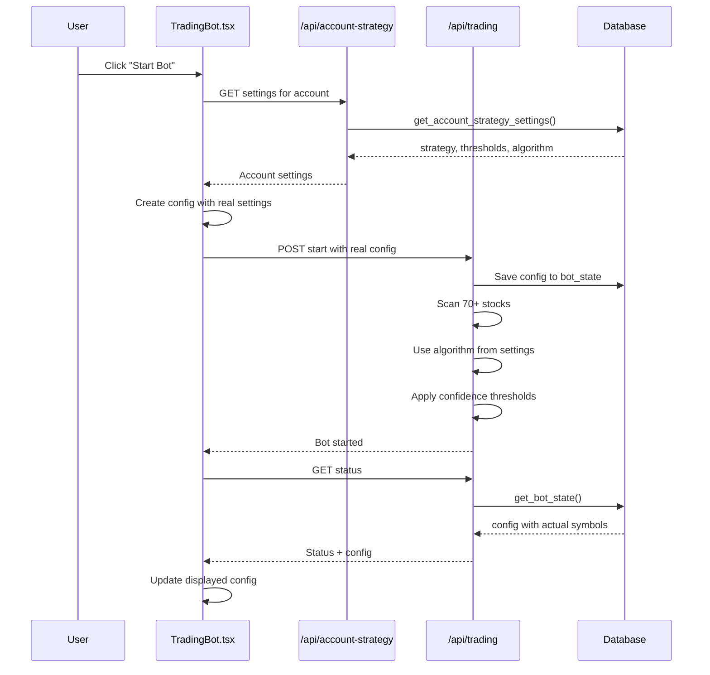

# Configuration Display Fix Summary

## Issues Fixed

### 1. ❌ Bot Info Showed Hardcoded Symbols
**Problem:** Info modal displayed "AAPL, MSFT, TSLA, SPY" instead of actual scanning results

**Root Cause:** 
- Frontend had hardcoded default config that was never updated
- Backend bot status API wasn't returning the actual config
- Actual bot scans 70+ stocks using `getDefaultScalpingStocks()` but UI didn't reflect this

**Fix:**
- ✅ Backend now returns `config` in bot status response
- ✅ Frontend updates its config state when bot status is fetched
- ✅ When starting bot, frontend fetches account strategy settings and creates proper config

### 2. ❌ Strategy Showed "cash" Instead of Saved Settings
**Problem:** Info modal always showed strategy as "cash" even when "25k_plus" was saved

**Root Cause:**
- Frontend config had hardcoded default: `strategy: mode === 'paper' ? 'cash' : '25k_plus'`
- This default was sent to backend when starting bot
- Actual account settings were ignored

**Fix:**
- ✅ Frontend now fetches account strategy settings before starting bot
- ✅ Creates config with actual strategy from database
- ✅ Config displayed in info modal reflects real settings

### 3. ✅ Confidence Thresholds Now Work for All Algorithms
**Bonus Fix:** 
- Trading loop now prioritizes per-account settings over global settings
- Thresholds apply equally to ML Model, Simple, and Advanced algorithms
- Market risk adjustment works correctly for all algorithms

---

## What Changed

### Backend Changes

**File:** `app/api/trading/route.ts`

1. **Bot Status Now Returns Config:**
```typescript
return {
  // ... other fields
  config: dbBotState.config || null  // ← NEW
}
```

2. **Confidence Thresholds Priority Order:**
```typescript
// 1. Try account-specific settings first
if (accountId) {
  const { data: accountSettings } = await supabase.rpc('get_account_strategy_settings', {...})
  // Use account settings
}

// 2. Fall back to global user settings
if (!accountId || not_found) {
  const { data: userSettings } = await supabase.from('user_settings')...
  // Use global settings
}

// 3. Use hardcoded defaults
// BUY: 65%, SELL: 50%
```

### Frontend Changes

**File:** `components/TradingBot.tsx`

1. **Config Updates from Bot Status:**
```typescript
if (data.status.config) {
  console.log('📝 Updating config from bot status:', data.status.config)
  setConfig(data.status.config)
}
```

2. **Fetches Account Settings Before Starting:**
```typescript
const startBot = async () => {
  // Fetch account settings
  const strategyResponse = await fetch(`/api/account-strategy?account_id=${accountId}`)
  const strategyData = await strategyResponse.json()
  
  // Create config with real settings
  botConfig = {
    symbols: [], // Populated by scanner
    interval: 60,
    settings: {
      strategy: strategyData.settings.strategy,  // ← From DB
      account_type: strategyData.settings.account_type,
      confidence_threshold: strategyData.settings.confidence_threshold,
      max_exposure: strategyData.settings.max_exposure
    },
    accountType: mode,
    strategy: strategyData.settings.strategy
  }
}
```

---

## How It Works Now

### When You Click "Start Bot":



### What Info Modal Shows Now:

**Before Fix:**
```
Symbols: AAPL, MSFT, TSLA, SPY    ← Hardcoded
Strategy: cash                     ← Hardcoded
Interval: 10 seconds              ← Hardcoded
```

**After Fix:**
```
Symbols: [70+ stocks from scanner] ← Real data
Strategy: 25k_plus                 ← From your settings
Interval: 60 seconds              ← Real bot config
Algorithm: rule_based_advanced     ← From your settings
```

---

## Verification Steps

### 1. Check Strategy Settings Are Saved

1. Open Strategy Modal for an account
2. Set Strategy to "25k_plus"
3. Set BUY threshold to 70%
4. Set SELL threshold to 55%
5. Select "Rule-Based (Advanced)"
6. Save

### 2. Start Bot and Verify

1. Start the bot
2. Click the Info (ℹ️) button
3. **Config should now show:**
   - ✅ Strategy: "25k_plus" (not "cash")
   - ✅ Symbols: Array of 70+ stocks (not just 4)
   - ✅ Confidence thresholds from your settings

### 3. Check Bot Logs

Look for these log lines:
```
📝 Starting bot with account strategy settings: {...}
✅ Using BUY confidence from account settings: 70%
✅ Using SELL confidence from account settings: 55%
🎯 Using algorithm type: rule_based_advanced for account...
📊 FINAL THRESHOLDS: BUY=74.5%, SELL=50.5%
   These thresholds apply to ALL algorithms (ML Model, Simple, Advanced)
```

---

## No More Hardcoded Values!

✅ **Symbols:** Dynamically scanned (70+ stocks)  
✅ **Strategy:** From account_strategy_settings  
✅ **Confidence Thresholds:** From account_strategy_settings  
✅ **Algorithm Type:** From account_strategy_settings  
✅ **Account Type:** From account_strategy_settings  
✅ **Max Exposure:** From account_strategy_settings  

Everything is now pulled from your actual saved settings! 🎉

