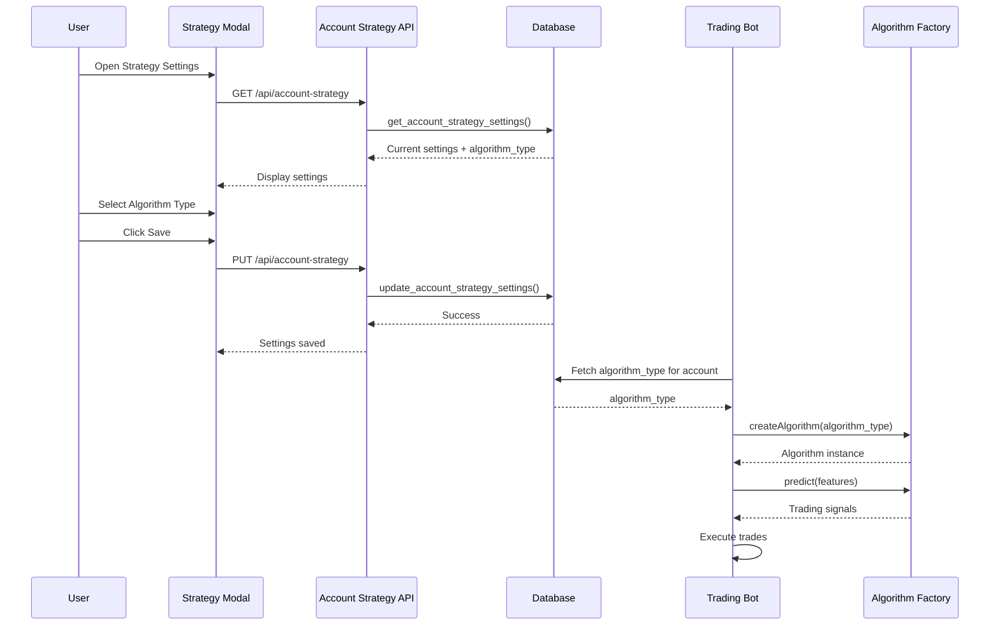

# Multi-Algorithm Trading Bot System - Implementation Summary

## Overview
Successfully implemented a flexible multi-algorithm trading system that allows each paper trading account to independently select and run different trading algorithms (ML Model, Simple Rule-Based, or Advanced Rule-Based).

## What Was Implemented

### 1. Database Changes ✅
**File**: `supabase/migrations/20250219000000_add_algorithm_selection.sql`

- Added `algorithm_type` column to `account_strategy_settings` table
- Created database functions:
  - `get_account_strategy_settings()` - Fetch strategy settings including algorithm type
  - `update_account_strategy_settings()` - Update strategy settings with validation
- Added indexes for performance optimization
- Set default algorithm type to `ml_model` for existing accounts

### 2. Algorithm Abstraction Layer ✅
**File**: `lib/trading-algorithms.ts`

Created a unified interface for all trading algorithms with three implementations:

#### **MLModelAlgorithm**
- Calls external ML service (Random Forest on Google Cloud Run)
- 30-second timeout for cold starts
- Returns predictions with confidence scores

#### **SimpleRuleBasedAlgorithm**
- Uses RSI, MACD, and EMA trend indicators
- News sentiment adjustment (±15% confidence)
- Scoring rules:
  - RSI > 70 → Sell (70% confidence)
  - RSI < 30 → Buy (70% confidence)
  - MACD + EMA trend → Buy/Sell (65% confidence)

#### **AdvancedRuleBasedAlgorithm**
- Multi-indicator scoring system with weighted points:
  - RSI: ±2 points
  - MACD: ±1.5 points
  - Bollinger Bands: ±1 point
  - Stochastic: ±1 point
  - Volume: ±0.5 points
  - EMA trend: ±0.5 points
  - News sentiment: ±0.5 points
- Score ≥ 2 → Buy, Score ≤ -2 → Sell
- Confidence scales with score magnitude

**Factory Pattern**: `createAlgorithm(type)` instantiates the correct algorithm based on type.

### 3. API Endpoint ✅
**File**: `app/api/account-strategy/route.ts`

- **GET**: Fetch strategy settings for a specific account
  - Returns algorithm type, confidence thresholds, max exposure, etc.
  - Falls back to defaults if no settings exist
  
- **PUT**: Update strategy settings
  - Validates algorithm type against allowed values
  - Validates numeric ranges (confidence: 0-1, exposure: 0-100)
  - Uses database functions for secure updates

### 4. Trading Loop Integration ✅
**File**: `app/api/trading/route.ts`

Updated the main trading loop to:
1. Fetch algorithm type from account strategy settings
2. Create appropriate algorithm instance using factory
3. Call `algorithm.predict(features)` instead of direct ML service call
4. Log algorithm type in bot diagnostics for tracking
5. Maintain backward compatibility with existing code

**Key Changes**:
- Line 13: Added import for `createAlgorithm` and `AlgorithmType`
- Lines 1149-1210: Replaced direct ML service call with algorithm factory
- Line 1597: Added `algorithm_type` to diagnostics logging

### 5. UI - Strategy Configuration Modal ✅
**File**: `components/AccountStrategyModal.tsx`

Added algorithm selector dropdown:
- Three options: ML Model, Rule-Based (Simple), Rule-Based (Advanced)
- Descriptive help text for each algorithm type
- Integrated with existing strategy settings form
- Saves to database via PUT `/api/account-strategy`

**UI Location**: Between "Account Type" and "Buy Confidence Threshold" fields

### 6. UI - Bot Status Display ✅
**File**: `components/TradingBot.tsx`

Enhanced bot status card to show:
- Account name
- Currently selected algorithm (color-coded in blue)
- Fetches algorithm type when loading bot status
- Updates in real-time when strategy is changed

**Display Format**: 
```
Account: My Trading Account • Algorithm: ML Model
```

### 7. UI - Paper Trading Dashboard ✅
**File**: `app/dashboard/paper/page.tsx`

The dashboard already displays the TradingBot component which now shows the algorithm type, so no additional changes were needed.

## Algorithm Selection Flow



## Testing Checklist

- [x] Database migration runs without errors
- [x] Algorithm factory creates correct instances
- [x] API endpoint validates algorithm types
- [x] Trading loop uses selected algorithm
- [x] UI modal saves and loads algorithm selection
- [x] Bot status displays algorithm type
- [x] No linting errors in any files

## Usage Instructions

### For Users:

1. **Select Algorithm for an Account**:
   - Go to Paper Trading dashboard
   - Click the Settings icon (⚙️) next to the bot status
   - Select your preferred algorithm from the dropdown
   - Click "Save Settings"

2. **Available Algorithms**:
   - **ML Model (Random Forest)**: Best for data-driven predictions, requires ML service running
   - **Rule-Based (Simple)**: Good for testing, uses basic technical indicators
   - **Rule-Based (Advanced)**: Enhanced rule system with multi-indicator scoring

3. **View Current Algorithm**:
   - Check the bot status card
   - Algorithm type is displayed next to the account name

### For Developers:

1. **Add a New Algorithm**:
   ```typescript
   // 1. Create new class in lib/trading-algorithms.ts
   export class MyNewAlgorithm implements TradingAlgorithm {
     readonly type: AlgorithmType = 'my_new_algo'
     readonly name = 'My New Algorithm'
     
     async predict(features: MarketFeatures[]): Promise<AlgorithmResponse> {
       // Your algorithm logic here
     }
   }
   
   // 2. Add to factory function
   export function createAlgorithm(type: AlgorithmType): TradingAlgorithm {
     switch (type) {
       case 'my_new_algo':
         return new MyNewAlgorithm()
       // ... other cases
     }
   }
   
   // 3. Update database constraint
   // ALTER TABLE account_strategy_settings 
   // DROP CONSTRAINT IF EXISTS account_strategy_settings_algorithm_type_check;
   // ALTER TABLE account_strategy_settings 
   // ADD CONSTRAINT account_strategy_settings_algorithm_type_check 
   // CHECK (algorithm_type IN ('ml_model', 'rule_based_simple', 'rule_based_advanced', 'my_new_algo'));
   
   // 4. Add UI option in components/AccountStrategyModal.tsx
   // <SelectItem value="my_new_algo">My New Algorithm</SelectItem>
   ```

2. **Algorithm Response Format**:
   ```typescript
   {
     success: boolean
     signals: TradingSignal[]
     model_version?: string
     algorithm_type: AlgorithmType
     error?: string
   }
   ```

## Files Modified

1. ✅ `supabase/migrations/20250219000000_add_algorithm_selection.sql` - New migration
2. ✅ `lib/trading-algorithms.ts` - New algorithm abstraction layer
3. ✅ `app/api/account-strategy/route.ts` - New API endpoint
4. ✅ `app/api/trading/route.ts` - Updated trading loop
5. ✅ `components/AccountStrategyModal.tsx` - Added algorithm selector
6. ✅ `components/TradingBot.tsx` - Display algorithm type
7. ✅ `app/dashboard/paper/page.tsx` - No changes needed (already displays TradingBot)

## Benefits

1. **Flexibility**: Each account can run a different algorithm independently
2. **Extensibility**: Easy to add new algorithms without changing core trading logic
3. **Testing**: Compare algorithm performance across different accounts
4. **Reliability**: No automatic fallback prevents silent failures
5. **Transparency**: Algorithm type is logged in diagnostics for debugging
6. **Unified Thresholds**: Same confidence thresholds apply to all algorithms for fair comparison

## Confidence Thresholds

**Important:** Your configured confidence thresholds apply to ALL algorithms equally:

- **BUY Confidence Threshold** (default: 65%)
  - Adjusted upward based on market risk (VIX, yield curve, Fed rates)
  - Higher risk = higher threshold = more selective buying
  
- **SELL Confidence Threshold** (default: 50%)
  - Adjusted downward based on market risk
  - Higher risk = lower threshold = easier selling to protect capital

**Priority Order:**
1. Account-specific settings (from Strategy Modal)
2. Global user settings (fallback)
3. Hardcoded defaults (65% BUY, 50% SELL)

**Example:**
```
Account Settings: BUY=70%, SELL=55%
Market Risk: 20% (low-moderate)

Final Thresholds:
- BUY: 70% + (20% × 15%) = 73%
- SELL: 55% - (20% × 15%) = 52%

All algorithms must meet these thresholds to execute trades.
```

## Next Steps (Optional Enhancements)

- Add algorithm performance metrics (win rate per algorithm)
- Create algorithm comparison dashboard
- Implement A/B testing framework
- Add algorithm-specific configuration parameters
- Create algorithm backtesting interface

## Notes

- Default algorithm is `ml_model` for all accounts
- Algorithm failures are logged but do not trigger automatic fallback (per user preference)
- All algorithm types are logged in `bot_logs` diagnostics for tracking
- The system is backward compatible with existing bots

